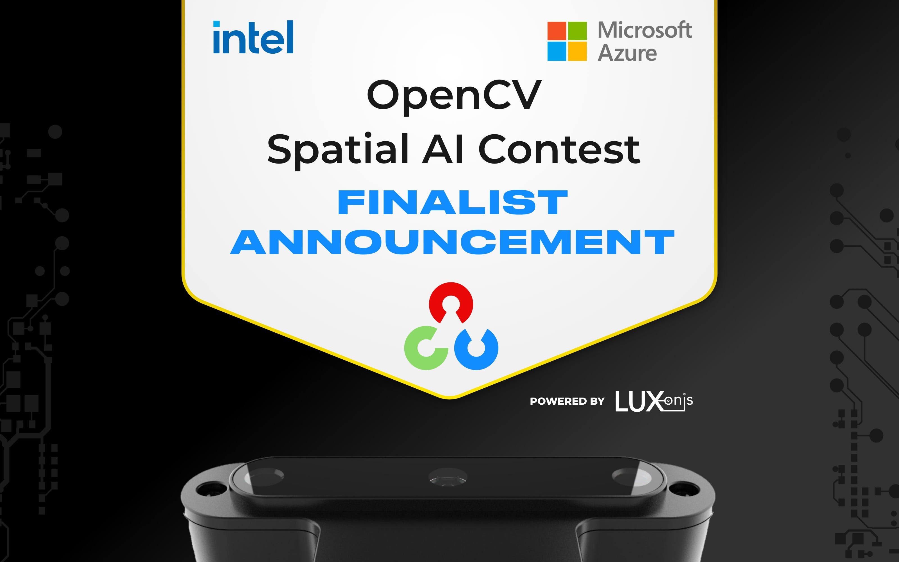

# Spatial AI Contest

This repo contains the code for the [#OAKDLiteContest](https://opencv.org/opencv-spatial-ai-contest/) developed by team Guadalquivir Titans.

## Ultimate Waste Collector
Ultimate Waste Collector is the final submission from Guadalquivir Titans team, we have created a robot capable of identifying and collecting different types of waste.

Check out the [project diary](diary/project_diary.md).
## Youtube Video

