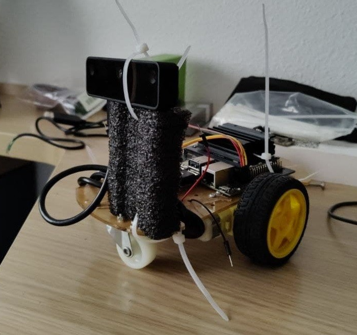
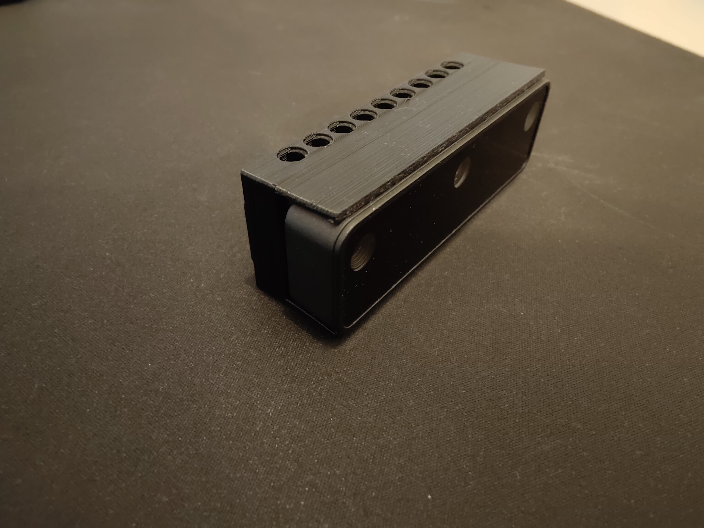
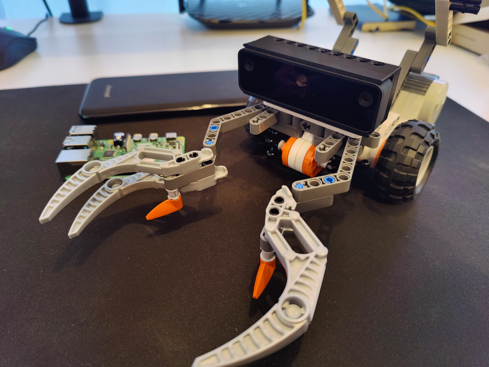

# First Update (02/20/2022)

At the beginning of the year I told you that our proposal was going through to the next phase of the OpenCV Spatial AI Contest which means that we have until April to implement our idea using OAK-D Lite camera and LEGO kits we have won.

While the LEGO kit were arriving I started to explore the OAK-D Lite and Luxonis library to interact with the camera. I created a car prototype with 2 servo-motors controlled by NVIDIA Jetson Nano and an Adafruit motor driver.

This is how the prototype with the OAK-D looked like:

In spite of the difficulties caused by the shortage devices and kits have arrived and we have been able to start creating our project.

I decided to start printing in 3D a case for the OAK-D Lite camera LEGO compatible in order to be able to attach it to our robot. Thanks to Adam, another participant in the competition who kindly shared the model among the community.

Credits to [Adam repository](https://github.com/muelleradam/OLLA) for the 3D model.

With our proposal in mind, I have build a robot capable of grasping object and although it is probably not the final version and it isn't connected to the Raspberry Pi shield it looks very good.

