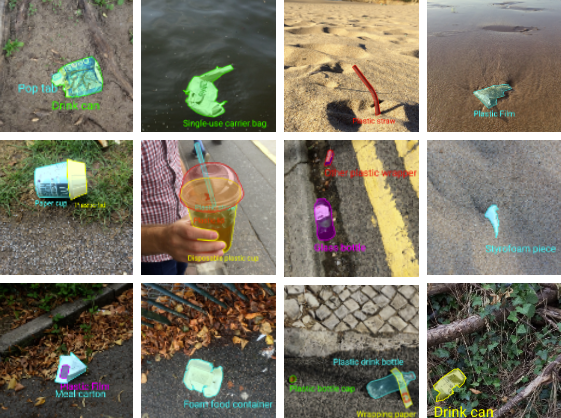

# Project Diary

At the beginning of the year I told you that our proposal was going through to the next phase of the OpenCV Spatial AI Contest which means that we have until April to implement our idea using OAK-D Lite camera and LEGO kits we have won.

While the LEGO kit were arriving I started to explore the OAK-D Lite and Luxonis library to interact with the camera. I created a car prototype with 2 servo-motors controlled by NVIDIA Jetson Nano and an Adafruit motor driver.

This is how the prototype with the OAK-D looked like:

In spite of the difficulties caused by the shortage devices and kits have arrived and we have been able to start creating our project.

I decided to start printing in 3D a case for the OAK-D Lite camera LEGO compatible in order to be able to attach it to our robot. Thanks to Adam, another participant in the competition who kindly shared the model among the community.

Credits to [Adam repository](https://github.com/muelleradam/OLLA) for the 3D model.

With our proposal in mind, I have build a robot capable of grasping object and although it is probably not the final version and it isn't connected to the Raspberry Pi shield it looks very good.

## Model training

We trained a [Tiny YOLO V4](https://github.com/AlexeyAB/darknet) with [TACO dataset](http://tacodataset.org/) (Waste on the environment) using 2 classes, plastic bottles and cans but due to a poor performance we had to take some extra photos and label them to improve the performance on the tiny model.

Extra data using Yolo Label:

To train the model at full speed we made use of the credits provided in Azure ML Studio, after that we converted the model to OpenVino format to use them on the OAK-D Lite camera.

## Making the robot to work

To move the 2 wheels and the hook we used a Raspberry PI 4 with the [PI-Hat module](https://www.raspberrypi.com/products/build-hat/). The Pi Hat module has a library to use the most popular LEGO Motors that made our life easier since we only had to use the detections provided by the OAK-D to adjust the wheel speed and depth to trigger the hook.

## Thank you

We would like to finish by thanking OpenCV, it has been a wonderful experience to participate in the competition. You make incredible hardware, thank you for giving us the opportunity to try it and keep learning with this kind of initiative.

